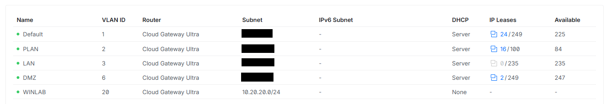
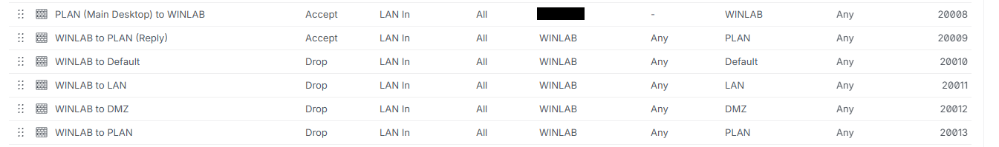

# Lab Architecture and Network Segmentation

## Overview

This project uses a dedicated network segment for the Windows Enterprise
Homelab. The objective is to provide a controlled environment for deploying
and administering Windows Server infrastructure while preventing lab systems
from initiating connections to homelab & home networks.

The lab uses an existing Proxmox homelab. Network segmentation is configured using
VLANs and firewall policies on a UniFi gateway.

## Network Design

| Network | VLAN | Subnet | Purpose |
|---|---:|---|---|
| WINLAB | 20 | 10.20.20.0/24 | Windows Server enterprise lab |

The UniFi Cloud Gateway Ultra provides the WINLAB Layer 3 gateway:

- **Gateway:** `10.20.20.1`
- **Subnet:** `10.20.20.0/24`
- **VLAN:** `20`
- **IPv6:** Disabled
- **Internet access:** Enabled
- **Gateway DHCP:** Disabled

DHCP is intentionally not provided by the UniFi gateway. A dedicated
Windows Server (`DHCP01`) will later provide DHCP services as part of the
Windows Server networking implementation.

### VLAN Configuration

The screenshot shows WINLAB as VLAN 20, subnet `10.20.20.0/24`, with gateway DHCP disabled.

The dedicated VLAN provides a separate broadcast domain for the Windows
lab and allows traffic between the lab and existing networks to be
controlled at the gateway.

## Firewall Segmentation

The configured policy is intended to prevent WINLAB from initiating connections
to the existing internal networks. Traffic validation is pending VM deployment.

| Source | Destination | Action | Purpose |
|---|---|---|---|
| Main Administration Desktop (`10.XXX.XXX.XXX`) | WINLAB | Allow | Permit administration of lab systems |
| WINLAB | PLAN | Allow Established/Related | Permit response traffic to management connections |
| WINLAB | Default | Drop | Prevent access to Default network |
| WINLAB | LAN | Drop | Prevent access to LAN |
| WINLAB | DMZ | Drop | Prevent access to DMZ |
| WINLAB | PLAN | Drop | Prevent lab systems initiating connections to PLAN |

### Firewall Policy

Management access follows a least-privilege model. Rather than allowing
the entire PLAN network to initiate connections to WINLAB, access is
restricted to the primary administration workstation.

The intended stateful policy permits replies to established or related
management connections while blocking new connections from WINLAB to PLAN.

The screenshot shows rule order and actions, but does not show the connection-state
settings for the reply rule. Confirm that it matches only Established/Related
traffic before treating this restriction as verified.

## DHCP Design

DHCP is disabled on the UniFi gateway for WINLAB.

The planned Windows infrastructure will use:

| Server | Address | Role |
|---|---|---|
| DC01 | 10.20.20.10 | AD DS / DNS |
| DC02 | 10.20.20.11 | AD DS / DNS |
| FILE01 | 10.20.20.12 | File Services |
| DHCP01 | 10.20.20.13 | DHCP |
| MGMT01 | 10.20.20.14 | Management |

Until Windows DHCP is deployed, infrastructure servers will use static
addressing.

## Proxmox Network Design

> **Status: In progress**

WINLAB will be presented to the virtual machines through a dedicated
Proxmox bridge.

[Architecture diagram to be added]

## Validation

> **Status: Pending VM deployment**

Once the Proxmox networking and first WINLAB VM are available, the
following tests will be performed:

| Test | Expected Result | Result |
|---|---|---|
| WINLAB → Internet | Allowed | Pending |
| WINLAB → WINLAB gateway | Allowed | Pending |
| WINLAB → Default | Blocked | Pending |
| WINLAB → PLAN | Blocked | Pending |
| WINLAB → LAN | Blocked | Pending |
| WINLAB → DMZ | Blocked | Pending |
| Admin workstation → WINLAB | Allowed | Pending |
| WINLAB → Admin workstation (new connection) | Blocked | Pending |

## Security Considerations

The Windows lab is treated as an untrusted environment relative to the
existing home network.

This is particularly important because the environment may later be used
for security testing and contain deliberately vulnerable systems.

The current WINLAB environment is **network segmented, not air-gapped**.
It is configured to allow routed Internet connectivity through the UniFi gateway;
connectivity from a lab VM remains untested.

Future offensive-security exercises will use a separate Proxmox bridge
with no physical uplink, providing stronger isolation for attacker and
victim systems.