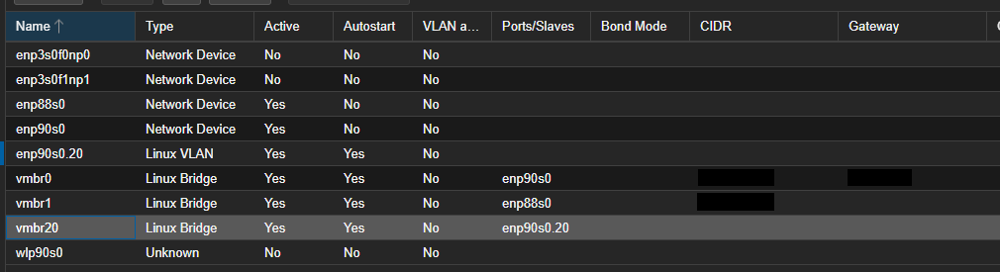
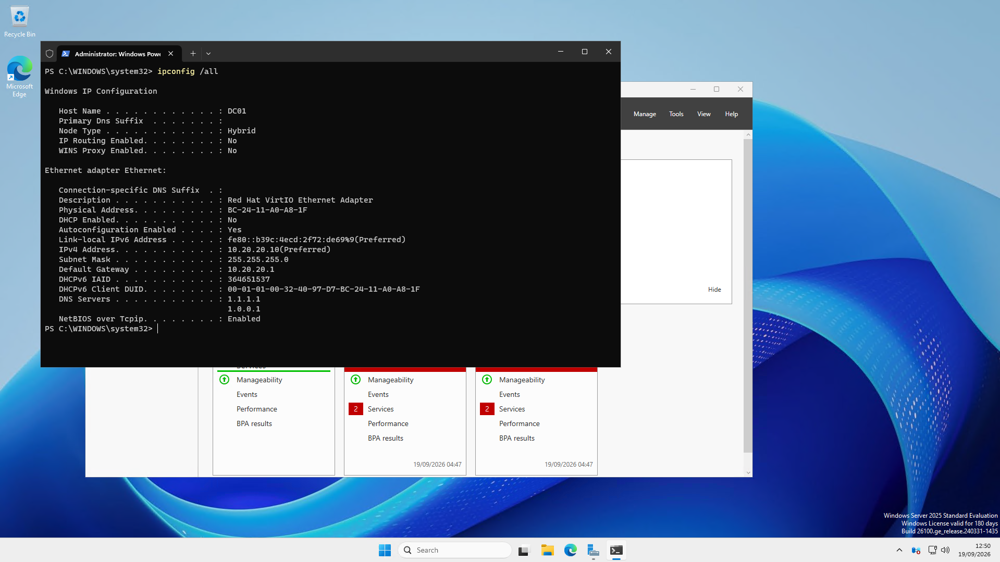
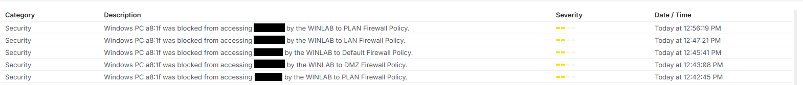

# Lab Architecture and Network Segmentation

## Overview

This project uses a dedicated network segment for the Windows Enterprise
Homelab. The objective is to provide a controlled environment for deploying
and administering Windows Server infrastructure while preventing lab systems
from initiating connections to homelab & home networks.

The lab uses an existing Proxmox homelab. Network segmentation is configured using
VLANs and firewall policies on a UniFi gateway.

## Network Design

| Network | VLAN | Subnet | Purpose |
|---|---:|---|---|
| WINLAB | 20 | 10.20.20.0/24 | Windows Server enterprise lab |

The UniFi Cloud Gateway Ultra provides the WINLAB Layer 3 gateway:

- **Gateway:** `10.20.20.1`
- **Subnet:** `10.20.20.0/24`
- **VLAN:** `20`
- **Gateway IPv6 configuration:** Disabled (Windows still has a link-local IPv6 address)
- **Internet access:** Enabled
- **Gateway DHCP:** Disabled

DHCP is intentionally not provided by the UniFi gateway. A dedicated
Windows Server (`DHCP01`) will later provide DHCP services as part of the
Windows Server networking implementation.

### VLAN Configuration

The screenshot shows WINLAB as VLAN 20, subnet `10.20.20.0/24`, with gateway DHCP disabled.

The dedicated VLAN provides a separate broadcast domain for the Windows
lab and allows traffic between the lab and existing networks to be
controlled at the gateway.

## Firewall Segmentation

The configured policy is intended to prevent WINLAB from initiating connections
to the existing internal networks. Tests from DC01 produced matching firewall
drop events for PLAN, DMZ, Default and LAN; see the validation evidence below.

| Source | Destination | Action | Purpose |
|---|---|---|---|
| Main Administration Desktop (`10.XXX.XXX.XXX`) | WINLAB | Allow | Permit administration of lab systems |
| WINLAB | PLAN | Allow Established/Related | Permit response traffic to management connections |
| WINLAB | Default | Drop | Prevent access to Default network |
| WINLAB | LAN | Drop | Prevent access to LAN |
| WINLAB | DMZ | Drop | Prevent access to DMZ |
| WINLAB | PLAN | Drop | Prevent lab systems initiating connections to PLAN |

### Firewall Policy

Management access follows a least-privilege model. Rather than allowing
the entire PLAN network to initiate connections to WINLAB, access is
restricted to the primary administration workstation.

The intended stateful policy permits replies to established or related
management connections while blocking new connections from WINLAB to PLAN.

The screenshot shows rule order and actions, but does not show the connection-state
settings for the reply rule. Confirm that it matches only Established/Related
traffic before treating this restriction as verified.

## DHCP Design

DHCP is disabled on the UniFi gateway for WINLAB.

The planned Windows infrastructure will use:

| Server | Address | Role |
|---|---|---|
| DC01 | 10.20.20.10 | AD DS / DNS |
| DC02 | 10.20.20.11 | AD DS / DNS |
| FILE01 | 10.20.20.12 | File Services |
| DHCP01 | 10.20.20.13 | DHCP |
| MGMT01 | 10.20.20.14 | Management |

Until Windows DHCP is deployed, infrastructure servers will use static
addressing.

## Proxmox Network Design

> **Status: Configured and active; initial DC01 connectivity tests passed**

WINLAB now has a dedicated Linux bridge, `vmbr20`, connected to the
VLAN interface `enp90s0.20`. The VLAN interface carries VLAN 20 traffic
through the existing physical uplink, `enp90s0`.

| Component | Applied configuration |
|---|---|
| Lab bridge | `vmbr20` |
| Bridge port | `enp90s0.20` |
| Physical uplink | `enp90s0` |
| VLAN | `20` |
| Autostart | Enabled on the VLAN interface and lab bridge |
| VLAN awareness on lab bridge | Disabled; tagging is handled by the VLAN interface |
| Host IP and gateway on lab bridge | None configured |

The dedicated bridge gives lab VMs a clear attachment point. It does not
need a Proxmox host IP address to forward VM traffic. The existing `vmbr0`
continues to use `enp90s0`; `vmbr1` continues to use `enp88s0`.

### Applied Configuration Evidence

The configuration screenshot reviewed during setup shows `enp90s0.20` and
`vmbr20` active with autostart enabled,
and `vmbr20` connected to `enp90s0.20`. Existing management addresses are
redacted. This verifies the applied host configuration, not end-to-end
connectivity or firewall isolation.

### Initial Windows Server Deployment

DC01 is deployed with Windows Server 2025 Standard Evaluation (Desktop
Experience). It is the intended first domain controller; AD DS deployment
and domain-controller promotion have not yet been recorded as completed.

| Setting | Verified value |
|---|---|
| Windows hostname | `DC01` |
| Network adapter | Red Hat VirtIO Ethernet Adapter |
| IPv4 address | `10.20.20.10` |
| Subnet mask | `255.255.255.0` (`/24`) |
| Default gateway | `10.20.20.1` |
| DHCP | Disabled; static addressing configured |
| Temporary DNS resolvers | `1.1.1.1`, `1.0.0.1` |
| Remote administration | RDP connection from the administration workstation confirmed |

The screenshot confirms the hostname, VirtIO adapter, static IPv4 settings
and temporary Cloudflare DNS resolvers. Windows retains a link-local IPv6
address; disabling IPv6 on the gateway did not disable it inside the guest.
The temporary external DNS configuration will be reviewed when deploying
AD DS and the lab DNS service.

The lab bridge is `vmbr20`, backed by `enp90s0.20`. The VM attachment design
uses this bridge with the VM VLAN Tag blank because the VLAN interface
handles tagging. Initial tests from the server now confirm gateway and
external connectivity. VM hardware sizing and template creation are not
verified by the network evidence shown here.

## Validation

> **Status: Initial connectivity and four network-policy checks completed on 19 September 2026**

The following results combine PowerShell output supplied during setup,
confirmed RDP access, and the saved UniFi firewall evidence.

| Test | Expected result | Observed result / evidence |
|---|---|---|
| DC01 static IPv4 configuration | Planned address and gateway; DHCP disabled | Passed — `ipconfig /all`; screenshot above |
| DC01 → WINLAB gateway | Reachable | Passed — `Test-NetConnection 10.20.20.1` returned `PingSucceeded: True` |
| External DNS lookup | Name resolves | Passed — `Resolve-DnsName microsoft.com` returned A and AAAA records |
| DC01 → Internet TCP 443 | Connection allowed | Passed — test to `www.microsoft.com` returned `TcpTestSucceeded: True` |
| DC01 → Default test destination | Blocked | Matching WINLAB to Default firewall drop event |
| DC01 → PLAN test destination | Blocked | Proxmox portal attempt failed; matching WINLAB to PLAN firewall drop event |
| DC01 → LAN test destination | Blocked | Matching WINLAB to LAN firewall drop event |
| DC01 → DMZ test destination | Blocked | Docker portal attempt failed; matching WINLAB to DMZ firewall drop event |
| Administration workstation → DC01 | RDP allowed | Successful RDP connection confirmed during setup |
| DC01 → Administration workstation, new connection | Blocked | Passed — direct workstation attempt confirmed; WINLAB to PLAN drop event at 12:56:19 |

### Firewall Validation Evidence

The screenshot records blocks by the WINLAB to PLAN, DMZ, Default and LAN
policies. The device identifier ending `a8:1f` matches DC01's VirtIO MAC
address in the network configuration screenshot. Destination addresses
are redacted for publication. The additional PLAN event at 12:56:19 is the
direct administration-workstation test, as confirmed during setup. Together
with successful inbound RDP, this demonstrates the tested management connection
works while the tested new connection in the reverse direction is blocked.

These events confirm the firewall blocked the specific tested traffic;
they do not establish that every host, port or protocol was tested. The
summary events do not show protocol or destination port, so the LAN and
Default attempts are not labelled as verified ICMP or TCP tests. The TCP
443 check establishes a connection, not application-level HTTPS validation.

### Remaining Session 00 Work

Session 00 remains in progress. The clean-install snapshot and restore test,
Server and Windows 11 templates, topology diagram, and deliberate VLAN
misconfiguration break/fix exercise have not yet been verified or documented.
The reply rule's connection-state settings still require direct inspection;
the successful traffic tests do not expose those settings.

## Security Considerations

The Windows lab is treated as an untrusted environment relative to the
existing home network.

This is particularly important because the environment may later be used
for security testing and contain deliberately vulnerable systems.

The current WINLAB environment is **network segmented, not air-gapped**.
It is configured to allow routed Internet connectivity through the UniFi gateway;
DC01 has successfully resolved an external name and opened an outbound TCP 443 connection.

Future offensive-security exercises will use a separate Proxmox bridge
with no physical uplink, providing stronger isolation for attacker and
victim systems.